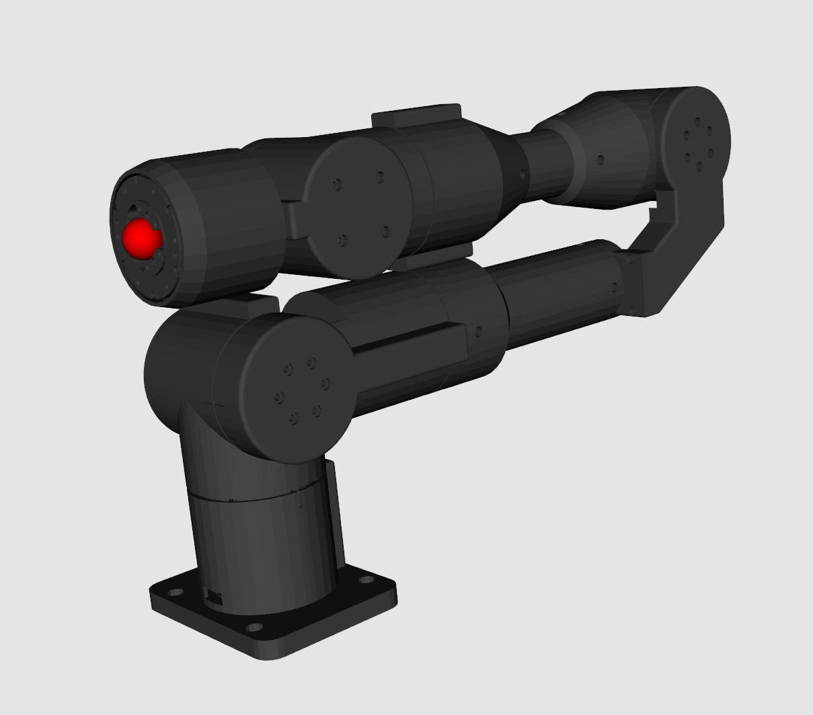
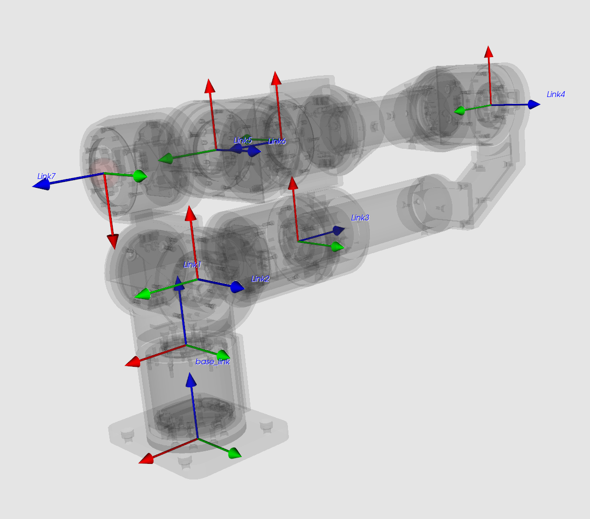
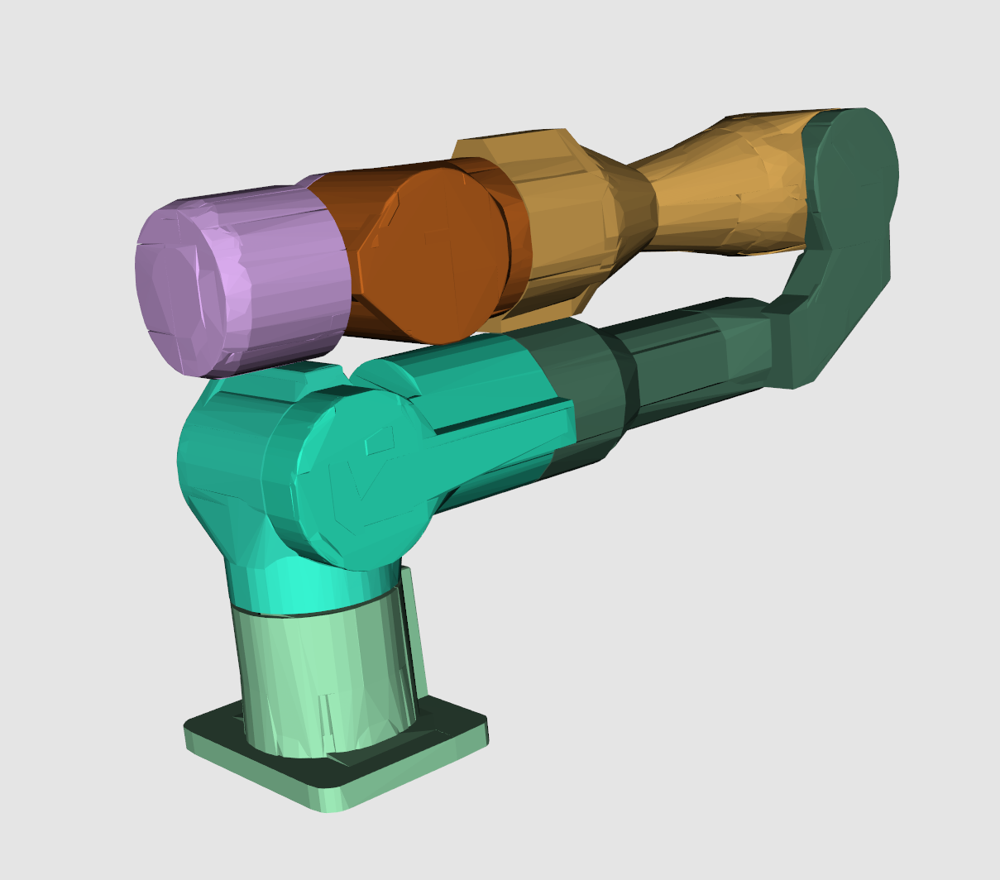

## GX7 Description

It is recommended to use [URDFly](https://github.com/Democratizing-Dexterous/URDFly) or use [robotsfan](http://urdf.robotsfan.com/) to view the URDF.

### Version 250919

The virtual meshes:

The link frames:

The collision meshes:

### Notation

It should be noted that the inertia parameters inside the `<inertial>` tags is not realistic.
